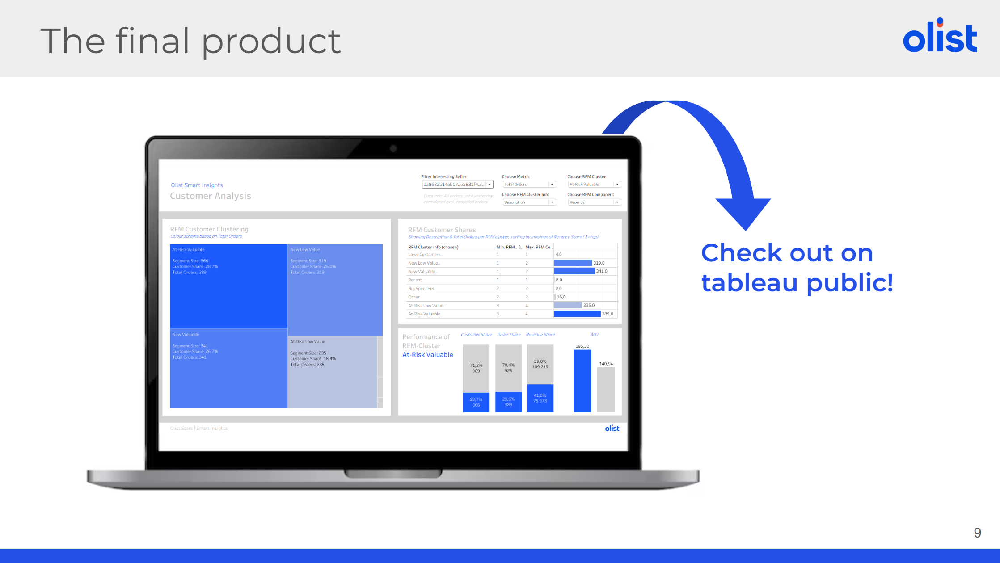

# RFM Analysis  
_This repository presents **my individual contributions** to a larger **Data Analytics Capstone Project** based on the **[Olist Brazilian E-Commerce dataset](https://www.kaggle.com/datasets/olistbr/brazilian-ecommerce)**._

  

## 📌 Project Overview

**Project goal**

Enhancing Olist's product portfolio with a **holistic premium dashboard** to **enable sellers to track their business performance** in various areas.

  

**Workflow**

 

## 🎯 My Contributions

| Area           | Scope                                                   |
|----------------|---------------------------------------------------------|
| [Data Pipeline](https://github.com/janinacarus/data-analytics-capstone-rfm/tree/main/data_pipeline)  | Data cleaning, merging, business segment prediction with RandomForest and creation of prep & mart tables |
| [Analytics](https://github.com/janinacarus/data-analytics-capstone-rfm/tree/main/rfm_analysis)      | RFM analysis and customer segmentation using K-Means   |
| [Visualization](https://public.tableau.com/views/RFMAnalysisCapstone/Dashboard?:language=de-DE&:sid=&:redirect=auth&:display_count=n&:origin=viz_share_link)  | Interactive Tableau dashboard for RFM customer segments |
| [Presentation](https://github.com/janinacarus/data-analytics-capstone-rfm/tree/main/presentation_full) | Presenting the final project |

 

## 📊 RFM Analysis 
A key characteristic of this RFM analysis is that **customer segmentation was performed at the seller level**.  
Each Olist seller has **its own individual RFM clusters**, allowing seller-specific insights into customer behavior.

The **[rfm.ipynb notebook](https://github.com/janinacarus/data-analytics-capstone-rfm/blob/main/rfm_analysis/rfm.ipynb)** demonstrates the complete RFM workflow for a **selected seller**, executing each step manually:
- Calculation of Recency, Frequency, and Monetary metrics per customer
- Applying the Elbow Method and K-Means clustering 
- Customer segmentation

This notebook serves as a transparent, step-by-step explanation of the methodology.

In contrast, the **[rfm_standardized.ipynb notebook](https://github.com/janinacarus/data-analytics-capstone-rfm/blob/main/rfm_analysis/rfm_standardized.ipynb)** represents a **scalable and automated approach**.  
It iterates over all sellers and performs RFM clustering programmatically for each of them. Due to this automated setup, the Elbow Method cannot be applied, as it requires manual interpretation and is not suitable for large-scale automation.

As a final result of the analysis, **each customer is assigned to a seller-specific RFM cluster**, enabling detailed, seller-level customer segmentation and performance evaluation.

 

## 📈 RFM Dashboard

**[Interactive RFM Dashboard](https://public.tableau.com/views/RFMAnalysisCapstone/Dashboard?:language=de-DE&:sid=&:redirect=auth&:display_count=n&:origin=viz_share_link) on Tableau Public**
 

 

## 🛠️ Tools & Technologies

- Python (Pandas, Matplot, Scikit-Learn)
- SQL
- Tableau
- Jupyter Notebooks
- GitHub
- Google Slides

 

## 🗂️ Data Sources

- **Olist E-Commerce Dataset** ([Kaggle](https://www.kaggle.com/datasets/olistbr/brazilian-ecommerce))  
- **Olist Marketing Funnel Dataset** ([Kaggle](https://www.kaggle.com/datasets/olistbr/marketing-funnel-olist))  
- **Brazilian Population Data** ([IBGE](https://www.ibge.gov.br/estatisticas/sociais/populacao/9103-estimativas-de-populacao.html?edicao=17283&t=downloads))