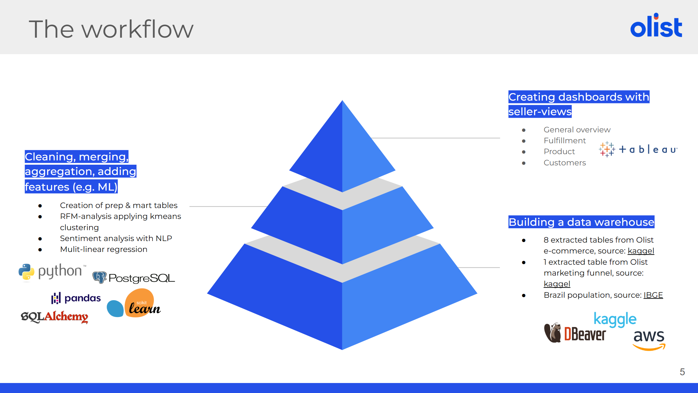

# RFM Analysis  
_This repository presents **my individual contributions** to a larger **Data Analytics Capstone Project** based on the **[Olist Brazilian E-Commerce dataset](https://www.kaggle.com/datasets/olistbr/brazilian-ecommerce)**._

## 📌 Project Overview

**Project goal**

Enhancing Olist's product portfolio with a **holistic premium dashboard** to **enable sellers to track their business performance** in various areas.

  

**Workflow**

## 🎯 My Contributions

| Area           | Scope                                                   |
|----------------|---------------------------------------------------------|
| Data Pipeline  | Data cleaning, merging, and creation of prep & mart tables |
| Analytics      | RFM analysis and customer segmentation using K-Means   |
| Visualization  | Interactive Tableau dashboard for RFM customer segments |

## 📊 RFM Analysis 
Customer behavior was analyzed using an **RFM model**, followed by **K-Means clustering** to identify meaningful customer segments.

## 📈 RFM Dashboard

[Interactive RFM Dashboard](https://public.tableau.com/views/RFMAnalysisCapstone/Dashboard?:language=de-DE&:sid=&:redirect=auth&:display_count=n&:origin=viz_share_link) on Tableau Public
 

## 🛠️ Tools & Technologies

- Python (Pandas, NumPy, Scikit-Learn)
- SQL
- Tableau
- Jupyter Notebooks
- GitHub
- Google Slides

## 🗂️ Data Sources

- **Olist E-Commerce Dataset** ([Kaggle](https://www.kaggle.com/datasets/olistbr/brazilian-ecommerce))  
- **Olist Marketing Funnel Dataset** ([Kaggle](https://www.kaggle.com/datasets/olistbr/marketing-funnel-olist))  
- **Brazilian Population Data** ([IBGE](https://www.ibge.gov.br/estatisticas/sociais/populacao/9103-estimativas-de-populacao.html?edicao=17283&t=downloads))